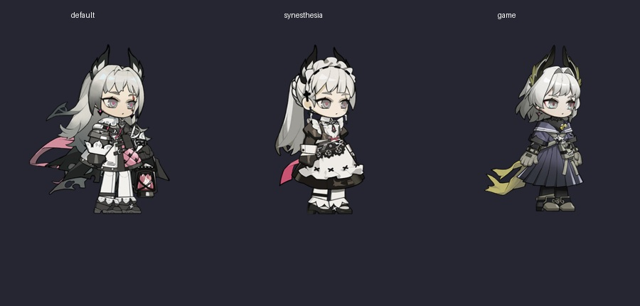

# 艾丽妮 · 提灯审阅员

《明日方舟》艾丽妮的 Codex 宠物素材包。`2.0.0` 同时提供定制 Q 版形象和官方基建小人；官方版包含默认、飞羽、至高判决三种外观。



## 下载与安装

从 [v2.0.0 Release](https://github.com/hhikr/irene-codex-pet/releases/tag/v2.0.0) 选择安装包：

| 安装包 | 内容 | 安装入口 |
| --- | --- | --- |
| `Irene-Codex-Pet-Official-v2.0.0.zip` | 官方基建小人，包含三种外观 | 双击 `install-official.cmd`，输入 `1`、`2` 或 `3` |
| `Irene-Codex-Pet-Custom-v2.0.0.zip` | 已有定制 Q 版形象，默认慢走，可选原跑步 | 在 PowerShell 执行 `& '.\install.ps1'` |

安装完成后，在 Codex 宠物设置中刷新列表，再重新选择艾丽妮。安装器写入当前用户的宠物目录，无需管理员权限。两个版本与三种官方外观共用同一宠物 ID，重新安装即可覆盖切换。

官方版也支持 PowerShell 参数：

```powershell
& '.\install-official.ps1' -Skin default
& '.\install-official.ps1' -Skin synesthesia
& '.\install-official.ps1' -Skin game
```

定制版恢复原跑步：`& '.\install.ps1' -Movement run`。

## 预览与素材

官方包打开 `preview-official.html`；定制包打开 `preview.html`。预览可切换画质、工作状态和宿主/连续循环节奏。官方页面另有五种原有动作的完整 20 fps 预览链接，保留正常眨眼与完整互动。网页工作流演示使用计时器，不读取实际 Codex 任务。

| 路径 | 内容 |
| --- | --- |
| `assets/native/`、`assets/hd/` | 定制形象的原生与高清图集 |
| `assets/official/<skin>/native.png` | 官方小人的 Codex v2 图集，1536×2288，单帧 192×208 |
| `assets/official/<skin>/hd.png` | 高清图集，3072×4576，单帧 384×416 |
| `assets/official/<skin>/previews/` | 原有动作的完整透明动画预览 |
| `assets/official/source/` | 三套 Spine 3.8.99 模型、纹理和来源哈希，供构建使用 |

图集使用八列十一行：九个工作状态及十六方向视线姿态。官方工作状态由原有基建动作映射而来。Codex 仍控制图集的帧数、时序和交互，完整预览的 20 fps 不代表宿主以相同速度播放。

官方版的安装、动作映射和构建步骤见 [官方小人使用说明](官方小人使用说明.md)。定制版见 [第四版使用说明](第四版使用说明.md)。当前产品为 Codex 素材包，尚未包含独立桌面程序或 VPet 模组。

## 许可

脚本与网页代码使用 [MIT 许可证](LICENSE)。官方模型、原作角色与衍生图像的权利说明见 [NOTICE.md](NOTICE.md)。
